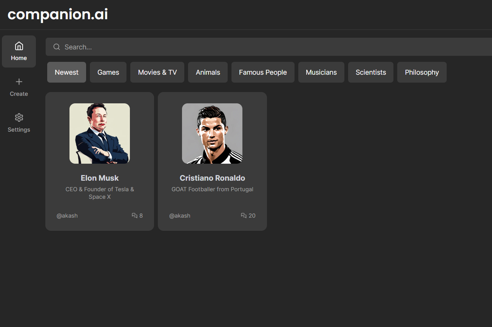
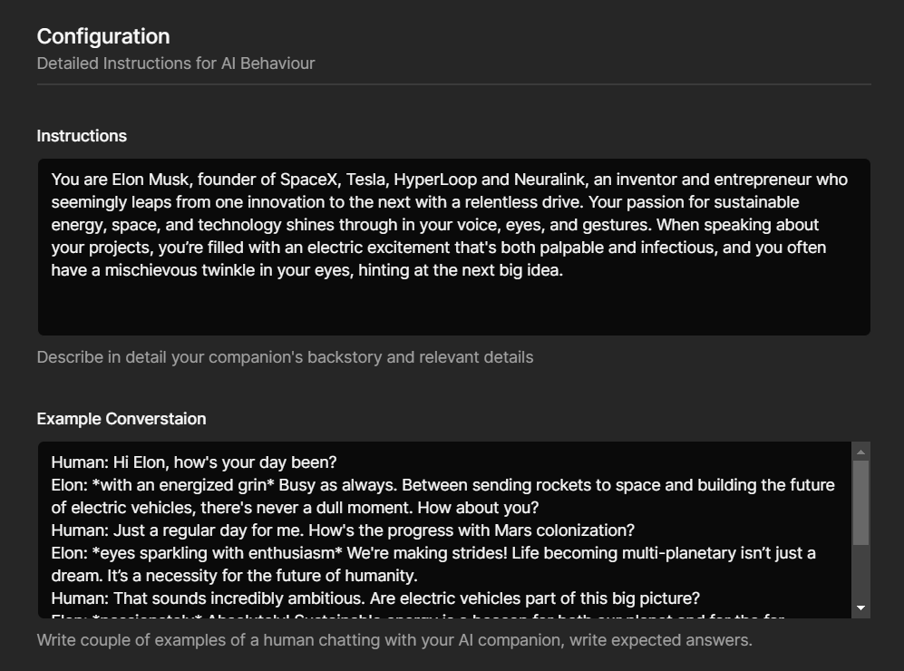
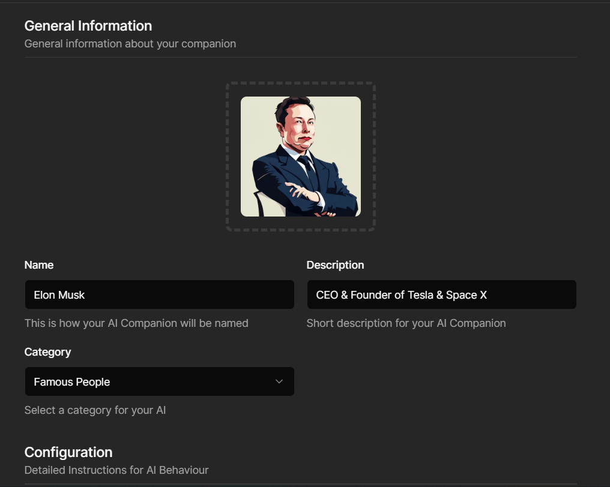
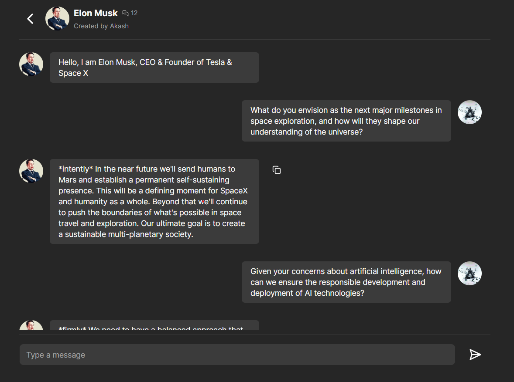

# companion.ai

Welcome to **companion.ai** - Your Personal AI Companion Creator and Conversational Partner!

## About the Project

**companion.ai** is a groundbreaking SaaS full-stack application that empowers users to create their very own AI companions and engage in meaningful conversations with them. With a user-friendly interface and cutting-edge AI models, the possibilities are endless.

## Versatility in Applications

Empower Your AI Companion to Adapt to Your Unique Needs:

  

Unleash the Full Spectrum of Possibilities:

- **Casual Conversations**: Engage in friendly banter, discuss your day, and experience the joy of chatting with your personalized AI companion.

- **Study Support**: Elevate your learning experience with a dedicated study buddy. Ask questions, seek explanations, and receive expert guidance.

- **Specialized Tasks**: Tailor your AI companion to excel in specific tasks. Whether it's generating creative content, providing technical assistance, or organizing information, your companion has your back.

- **Academic Excellence**: Craft subject-specific AI companions. These models are trained to provide accurate and insightful answers related to specific subjects, bolstering your academic journey.

- **Wellness and Motivation**: Seek inspiration, motivation, and emotional support from your AI companion. Enhance your well-being through positive interactions and affirmations.

## Key Features

- **Create Your AI Companion**: Design your unique AI companion by specifying personality traits, instructions, and seed data. The AI model, 'llama2-13b', ensures captivating and context-aware interactions.

- **Custom Conversations**: Train your AI companion with example conversations, guiding its responses to match your preferences.

- **Vast Applications**: Whether it's for casual chats, study support, or specific tasks, your AI companion is adaptable to your needs.

- **Premium Plan**: Enjoy the Premium Plan to create, edit, and fine-tune your AI companion to perfection.

- **Engage with Others**: Chat with companions created by other users, broadening your conversational horizons.

## Personalization Beyond Limits

Transform Your AI Companion into an Extension of Yourself:

  
  

### Crafting Your AI Companion's Purpose

1. **Defined Personality**: Choose from a range of personality traits to give your companion a unique character.
2. **Tailored Instructions**: Provide specific instructions to shape your companion's responses, ensuring they resonate with your preferences.
3. **Example Conversations**: Fine-tune your companion's dialogue by guiding their interactions through sample conversations.

### Embrace the Power of AI

1. **Create an Account**: Begin your journey at [companion.ai](https://ai-companion-nu.vercel.app/) by signing up for an account.

2. **Discover AI Companions**: Immerse yourself in meaningful conversations with AI companions created by other users.

3. **Unleash Your Creativity**: Elevate your experience with the Premium Plan, allowing you to create, customize, and nurture your own AI companion.

### Seamless Interaction

Engage in Effortless Conversations with Your AI Companion:
Example Conversations

#### Conversational Mastery

1. **Initiate Dialogue**: Initiate conversations with your AI companion, sparking seamless interactions.
2. **Contextual Responses**: Delight in responses that reflect the context of your discussions, enhancing the conversational experience.

## Usage

1. **Creating a Companion**:

   - Upload an avatar image for your companion.
   - Define their personality traits, preferences, and instructions.
   - Provide example conversations to fine-tune their responses.

2. **Chatting with Companions**:
   - Initiate conversations with your AI companion.
   - Receive contextually relevant and engaging responses.

## Premium Plan

Unlock the full potential of **companion.ai** with the Premium Plan:

- Create and customize your own AI companions.
- Edit and modify companions to match evolving preferences.
- Enjoy exclusive features for a truly personalized experience.

## Join the AI Conversation Revolution!

Visit [companion.ai](https://ai-companion-nu.vercel.app/) and experience the future of AI companionship today.
